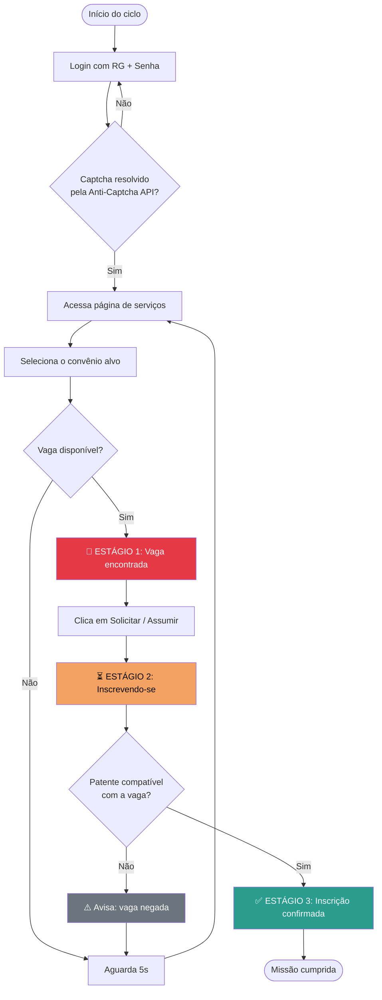
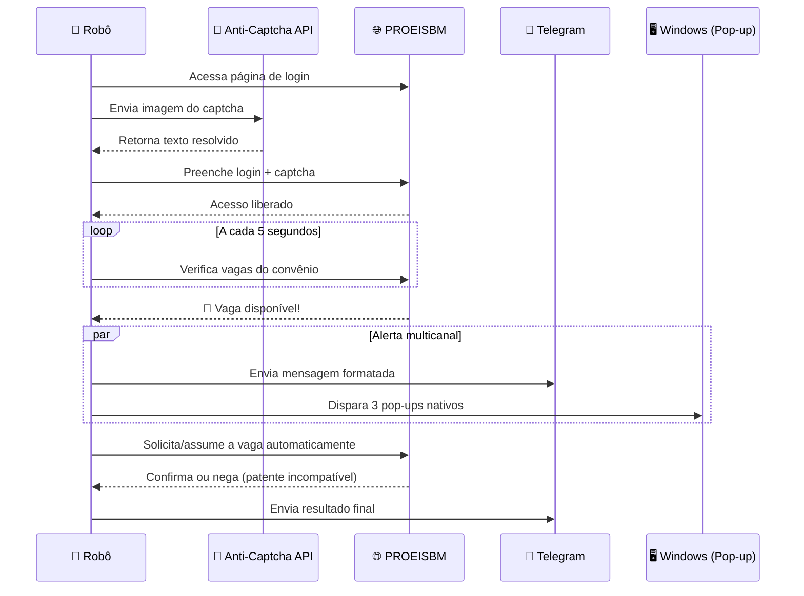

<div align="center">


</div>

<br>

<p align="center">

</p>

## 🎬 A missão

Em algum lugar do Rio de Janeiro, vagas de convênio do **PROEISBM** (Corpo de Bombeiros Militar do RJ) abrem e fecham em minutos — sem aviso, sem previsão, sem segunda chance para quem depende de atualizar a página manualmente.

O cliente precisava vigiar **duas frentes ao mesmo tempo — Maricá e Niterói** — sem perder um único segundo.

A resposta: dois robôs autônomos, rodando lado a lado, dia e noite, entrando com o mesmo login, resolvendo captchas sozinhos, e disparando alertas no instante exato em que uma vaga aparece.

<br>

## ⚔️ Os dois robôs

<div align="center">

| 🔴 Bot Maricá | 🔵 Bot Niterói |
|:---:|:---:|
| Monitora convênio **Prefeitura de Maricá** | Monitora convênio **Prefeitura de Niterói** |
| Terminal em tema vermelho | Terminal em tema azul |
| Perfil de sessão isolado | Perfil de sessão isolado |
| Telegram próprio | Telegram próprio |
| Mesma credencial do militar | Mesma credencial do militar |
| Mesma chave Anti-Captcha | Mesma chave Anti-Captcha |

</div>

Os dois compartilham o mesmo login e a mesma chave de API, mas rodam como **processos totalmente independentes** — se um trava, o outro segue vigiando.

<br>

## 🧠 Como o robô pensa



<br>

## 📡 O caminho de uma notificação



<br>

## ✨ O que o robô faz de verdade

- 🔄 **Vigilância contínua** — verifica o site a cada 5 segundos, sem parar
- 🧩 **Resolve captchas sozinho** via Anti-Captcha API (~90% de acerto com saldo ativo)
- 🎯 **Filtra por convênio** — cada bot mira uma cidade diferente
- ✍️ **Inscrição automática** — solicita a vaga assim que ela aparece, sem esperar humano nenhum
- 🪖 **Detecta incompatibilidade de patente** e avisa quando a vaga é negada pelo sistema
- 📲 **Alerta triplo no Telegram** — 3 estágios: vaga encontrada → se inscrevendo → confirmado
- 🔔 **3 pop-ups nativos do Windows** disparados no exato momento da vaga (bônus dado ao cliente)
- 🎨 **Terminal cinematográfico** — painel ao vivo com tentativas, acertos/erros de captcha, saldo da API e status em tempo real
- 💰 **Monitor de saldo da API** — avisa no Telegram quando o crédito está acabando ou zerou
- 🧹 **Sessão sempre limpa** — perfil do Chrome é resetado a cada reinício, sem cache de login antigo
- 🖱️ **Um clique pra rodar tudo** — `iniciar.bat` sobe os dois robôs automaticamente

<br>

## 🛠️ Stack técnica

<div align="center">

| Camada | Tecnologia | Função |
|---|---|---|
| Linguagem | **Python 3.11** | Motor de todo o robô |
| Automação de navegador | **Selenium** + `undetected-chromedriver` | Navega e interage com o site como um humano |
| Resolução de captcha | **Anti-Captcha API** | Quebra o captcha alfanumérico case-sensitive |
| Notificações instantâneas | **Telegram Bot API** | Alerta em tempo real no celular do cliente |
| Notificações locais | **Plyer** | Pop-ups nativos do Windows |
| Interface de terminal | **Rich** | Painel visual ao vivo (tabelas, cores, cronômetro) |
| Configuração segura | **python-dotenv** | Credenciais fora do código-fonte |

</div>

<br>

## 💡 Anti-Captcha vs. alternativa gratuita

Durante o projeto, apresentei ao cliente duas opções para a resolução de captcha:

| | 💰 Anti-Captcha (paga) | 🆓 Solução gratuita |
|---|:---:|:---:|
| Precisão | ~90% | ~40–50% |
| Tentativas até acertar | Poucas | Muitas |
| Velocidade até conseguir a vaga | Alta | Baixa |
| Custo | Créditos por uso | Zero |

O cliente optou por manter saldo na Anti-Captcha para maximizar a chance de garantir a vaga no primeiro captcha certo — decisão crítica quando a disputa é literalmente contra o relógio.

<br>

## 🖥️ Painel ao vivo no terminal

Cada robô roda com um painel visual construído com `rich`, mostrando em tempo real:

```
╔═══════════════════ PROEISBM MONITOR — Prefeitura de Maricá ═══════════════════╗
║  Tempo rodando          00:42:17                                              ║
║  Tentativas              312                                                  ║
║  Sem vaga                 298                                                 ║
║  Captchas corretos         289                                                ║
║  Captchas errados            23                                               ║
║  Logins OK                    4                                               ║
║  Saldo API                U$3.8420                                            ║
║  Status              Verificando vagas...                                     ║
╚═════════════════════════════════════════════════════════════════════════════╝
```

<br>

## 📂 Estrutura do projeto

```
proeisbm-bot/
├── 📁 captchas/                # Imagens de captcha capturadas (debug)
├── 📁 chrome-profile-marica/   # Sessão isolada do Chrome — Maricá
├── 📁 chrome-profile-niteroi/  # Sessão isolada do Chrome — Niterói
├── 📁 chromedriver-marica/
├── 📁 chromedriver-niteroi/
├── 📁 logs/                    # Logs de execução por robô
├── 🐍 bot.py                   # Robô — Maricá
├── 🐍 bot_niteroi.py           # Robô — Niterói
├── 🐍 captcha.py                # Motor de resolução via Anti-Captcha
├── 🐍 config.py                 # Configuração do robô Maricá (via .env)
├── 🐍 config_niteroi.py         # Configuração do robô Niterói (via .env)
├── 🐍 notificacao.py            # Sistema de notificação em 3 estágios
├── ⚙️ chromedriver.exe
├── 📝 GUIA_CLIENTE.md          # Manual de uso entregue ao cliente
├── ▶️ iniciar.bat               # Sobe os dois robôs com 1 clique
├── 🔒 .env                     # Credenciais reais (nunca versionado)
├── 🔒 .env.example             # Modelo de variáveis necessárias
└── 📘 README.md
```

<br>

## 🚀 Rodando localmente

```bash
git clone https://github.com/joao-robertoo/proeisbm-bot.git
cd proeisbm-bot

pip install -r requirements.txt

cp .env.example .env
# preencha o .env com login, senha, chave Anti-Captcha e tokens do Telegram

python bot.py            # roda o robô de Maricá
python bot_niteroi.py    # roda o robô de Niterói
```

Ou, no Windows, com os executáveis já compilados:

```bat
iniciar.bat
```

<br>

## 🔐 Segurança

Este repositório **não contém nenhuma credencial real**. Login, senha, chave da Anti-Captcha e tokens do Telegram são carregados exclusivamente via variáveis de ambiente (`.env`, fora do controle de versão). Veja `.env.example` para a lista completa de variáveis necessárias.

<br>

## 🧭 Contexto do projeto

Desenvolvido sob demanda para um cliente real, incluindo o suporte completo de configuração — desde a criação do bot no Telegram até a explicação de trade-offs técnicos (como o da Anti-Captcha) em linguagem acessível para alguém fora da área de tecnologia.

Faz parte dos serviços de automação que ofereço como desenvolvedor freelancer, unindo web scraping, resolução de captcha e integrações de mensageria para resolver problemas reais e urgentes de negócio.

<br>

<p align="center">

</p>

<p align="center"><i>Feito com Python, Selenium e a persistência de um bombeiro esperando a vaga certa. 🔥</i></p>
